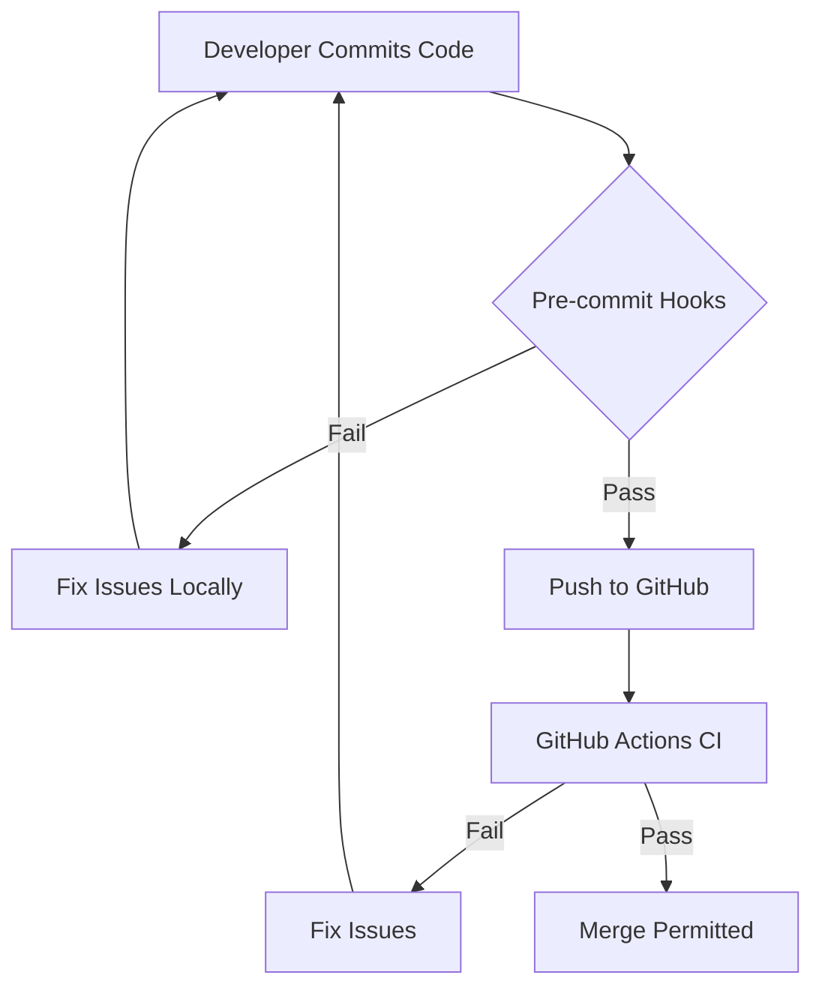

# CI/CD and Precommit Hooks Implementation

## Chosen Approach
Implement standardized GitHub Actions CI and Husky/lint-staged precommit hooks with progressive configuration files.

## Architecture Blueprint
- **Modules / Packages**
  - `.github/workflows` → CI pipeline definition and execution
  - `.husky` → Git hooks management
  - `package.json` → Hooks registration and script definitions
  - `.eslintrc.js` → TypeScript linting rules
  - `.prettierrc.js` → Code formatting rules

- **Public Interfaces / Contracts**
  - GitHub Actions Workflow Interface
    ```yaml
    name: CI
    on: [push, pull_request]
    jobs:
      test-lint-build:
        # job definition
    ```
  - Husky Hook Configuration
    ```json
    "husky": {
      "hooks": {
        "pre-commit": "lint-staged",
        "commit-msg": "commitlint -E HUSKY_GIT_PARAMS"
      }
    }
    ```

- **Data Flow Diagram**


- **Error & Edge-Case Strategy**
  - Precommit hooks: Fail fast with clear error messages before code leaves developer machine
  - CI pipeline: Detailed logs and error reporting
  - Bypass protection: Commit signing verification to prevent `--no-verify` abuse
  - File size handling: Warning at 500 lines, error at 1000 lines with clear guidance on refactoring

## Detailed Build Steps
1. **Set up ESLint configuration**
   - Install ESLint and TypeScript plugins
   - Create `.eslintrc.js` with Next.js and strict TypeScript rules
   - Add code quality rules including complexity and file length checks

2. **Set up Prettier configuration**
   - Install Prettier
   - Create `.prettierrc.js` with code formatting standards
   - Add `.prettierignore` for build artifacts

3. **Set up testing infrastructure**
   - Install Jest/React Testing Library
   - Configure test scripts in package.json
   - Create basic smoke test to verify setup

4. **Implement Husky pre-commit hooks**
   - Install Husky and lint-staged
   - Configure Husky for Git hook management
   - Set up lint-staged to run linting, formatting, and file size checks

5. **Set up commitlint for conventional commits**
   - Install commitlint
   - Create commitlint configuration
   - Configure Husky commit-msg hook

6. **Implement file size limits**
   - Create custom ESLint rules for file size warnings (500 lines)
   - Implement stricter errors for excessive files (1000+ lines)

7. **Create GitHub Actions CI workflow**
   - Create `.github/workflows/ci.yml`
   - Configure Node.js environment and caching
   - Set up jobs for linting, testing, and building

8. **Add security scanning**
   - Implement dependency vulnerability scanning
   - Add code security scanning with CodeQL

9. **Configure branch protection rules**
   - Require CI to pass before merging
   - Enforce pull request reviews
   - Prevent force pushes to protected branches

10. **Document CI/CD process**
    - Update README.md with badge and workflow explanation
    - Add CONTRIBUTING.md with development workflow details

## Testing Strategy
- **Unit Tests:** Verify custom ESLint rules for file size limits
- **Integration Tests:** Validate full pre-commit hook workflow on sample code violations
- **No mocking needed** as these are development tools running directly against the codebase
- **Coverage targets:** Not applicable for tooling (focuses on linting other code)
- **Edge cases to test:**
  - Complex commits with mixed valid/invalid files
  - Exceptionally large files (edge of limits)
  - Invalid commit messages

## Logging & Observability
- **CI Pipeline Logs:**
  - Structured output format for GitHub Actions
  - Artifact retention for test results and coverage reports
  - Failure notifications to team communication channels

- **Local Feedback:**
  - Colorized console output for hook operations
  - Clear error messages with fix instructions
  - Performance timing for slow hooks

## Security & Config
- **Input Validation:**
  - Sanitize all inputs to CI workflows
  - Validate GitHub event payloads

- **Secrets Handling:**
  - Use GitHub Secrets for any API tokens
  - No hardcoded credentials in workflows
  - Scope token permissions to minimum required

- **Least Privilege:**
  - GitHub workflow permissions limited to required actions
  - Branch protection to prevent unauthorized modifications to CI configuration

## Documentation
- **Self-documenting Configuration:**
  - Clear comments in all configuration files
  - Descriptive naming for workflows, jobs, and tasks

- **README Updates:**
  - Add CI badge indicating build status
  - Document pre-commit hook installation process
  - Include troubleshooting section for common issues

## Risk Matrix

| Risk | Severity | Mitigation |
|------|----------|------------|
| CI pipeline execution time becomes excessive | medium | Implement strategic caching, parallelize jobs, optimize test execution |
| Hooks become too restrictive causing developer friction | high | Implement progressive warnings before errors, allow specific exclusions with justification comments |
| False positives in linting/static analysis | medium | Fine-tune rules, add selective disabling with explicit reasoning |
| Dependency vulnerabilities emerge in CI tools | high | Regular updates, automated dependency scanning, minimal dependencies |
| Developers bypass hooks with `--no-verify` | critical | Team education, audit logging, server-side enforcement via branch protection |

## Open Questions
- What is the team's tolerance for CI pipeline duration?
- Are there specific existing code patterns that would need exemption from new rules?
- Should we implement automatic fixing of format/style issues or require manual fixes?